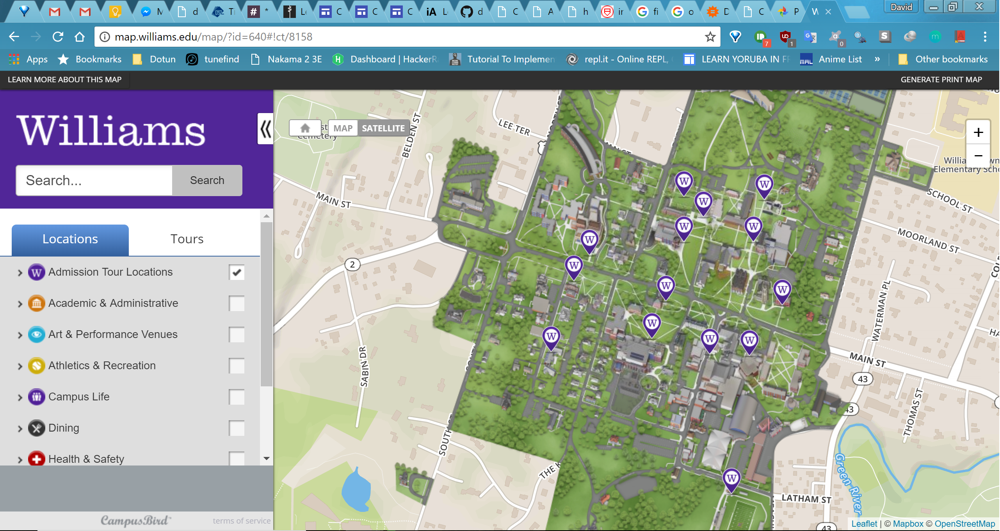

### Why the Map?
When I first got on the Williams College campus the spring of senior year, despite the campus being small, I needed a way to figure out where I was and where I was going. I found the app relatively easily through the main site and immediately knew what to do from there. Since good design is characterized by ease-of-use, the quickness of easily grasping what I needed is a large plus.

**Locating where I was:**
  - Campus grounds are colored and differentiated from rest of map, so easier to spot landmarks
  - Tourist spots were pointed to from the very beginning

**Locating where I was going:**
 - Icons I am already accustomed to automatically show over tourist landmarks
 - Search bar at the top for quick search of building names specific to campus
 - Left sidebar looks like standard layout for a sidebar as well as well-known hamburger menu icon to open it (mobile version only)

Overall I feel the map is intuitive as well as decent in terms of aesthetics. Both of these paired with its clear structure and ease-of-understanding, I would find this design to be more than adequate for its function.
