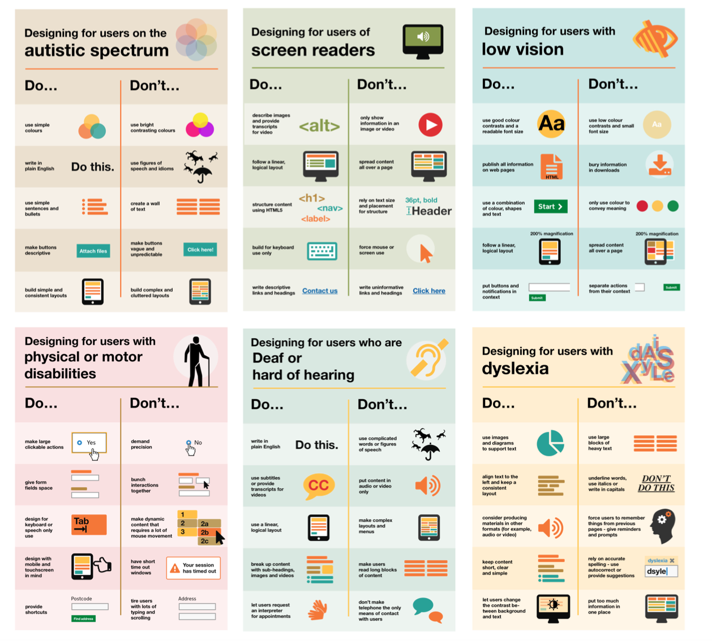

*Human-Computer Interaction, the study of how people interact with computers and to what extent computers are or are not developed for successful interaction with human beings.* - [Margaret Rouse](https://searchsoftwarequality.techtarget.com/definition/HCI-human-computer-interaction)

I think this definition eloquently defines the two sides of the scale for which the study hopes to balance as well as the two historically separate disciplines for which the study effectively combines. In the process of choosing to take a class focusing on design and the design process, everything I knew about design on a personal level was from emulating real-world designs I thought were interesting. Design to me felt more like of an abstract art than a quantifiable, measurable aspect of accomplishing a task, both of which I now see more clearly as parts of a larger whole. In my journey from start to finish, I participated in the design project, Sous Shopper, focusing as much on the process of designing it as to actually designing the product. From the project, I found that these 5 topics seemed to resonate when you explore them in their entirety. They are the following:
  1. Understand the problem at its root
  2. Define your ethical position responsibly
  3. Keep user accessibility in mind
  4. Collect and review feedback
  5. Churn out iterations

While I think there are generally more than these 5 categories, and this list certainly does not exhaust all aspects, I think what this list does provide is a generally encompassing group of important topics in design.  

### Understanding the Problem
Understanding any problem at its root is the most effective way of solving the problem. However, the scope of the problem is rarely and naively only what needs to be completed. If it involves people in any capacity, it then overwhelmingly involves considering who is needing the task to be completed as well as how and why they need to complete it. Understanding the problem at this scope allows you a frame for which your eventual solution can work through.

In Sous Shopper, the mode of understanding our problem was through initial private and group brainstorming sessions, conducting user research, then performing a task analysis. Brainstorming in this context is very important because unless their is a complete overhaul of your design, a version or at least key aspects of what is thought up in this step will end up in the final stages of your product. In Sous Shopper, fundamental decisions like the devices for which our solution will initially support usage as well as possible kinds of interfaces were generally defined and are still prevalent in the current product.

*Initial brainstorm of possible solutions in context of how the solution provides the needed information*

As for conducting user research, the group performed a combination of contextual inquiries and directed storytelling inquiries. While these are not the only forms of user research, specifically interviews and fly-on-the-wall observations were planned but could not be conducted due to logistical reasons, these two fit the best with our problem. Our goal was to amass pure information on the process by which shoppers select their produce so as to identify the key tasks done by a shopper and the underlying problem with any of the tasks by which or product could seamlessly fix. We conducted the inquiries on a variety of available people, taking some to grocery stores to watch them pick out produce as well as asking all of them questions and having them think aloud as they were shopping or reenacting a recent shopping experience. The main questions are as follows:

  - Do you have a grocery list, or do you decide on the spot?
    * If yes, what do you plan to buy?
  - How do you choose your produce?
    * Did you learn from anyone (i.e. a parent)?
    * Do you choose produce based on what’s in season?
    * Is it important to you that your produce is local?
  - Are you open to discovering new kinds of produce?

As for the task analysis, we used questions on what goes into the tasks being performed. Some of the more applicable are as follows:
  1. Who is going to use the design?
  2. What tasks do they now perform verses what tasks are desired?
  3. Where are the tasks performed?
  4. What other tools does the person have?
  5. How often are the tasks performed?
  6. What are the time constraints on the tasks?
  7. What happens when things go wrong?

Throughout this portion of design, the foundation of what the product is currently was established. The inquiries as well as the line of questioning brought forth very insightful and realistic views on the problems needing to be fixed, general aspects an average user would focus on, and the constraints of designing a product to be used while shopping. Perhaps the biggest realization was that we were not designing a product for ourselves but for people with possibly different needs than us. Thus getting as much outside information as possible is what will contribute the greatest towards finding a suitable solution.

### Ethics
Perhaps the biggest next step to consider when thinking about what should direct a design process is ethics. At this phase in design, once you have dug deep into the problem at hand and have some grasp of what the general form of a solution should look like, the next step is to set up boundaries for yourself before going forward. This cannot be stressed enough, because a leap in the wrong direction this early in the design process will have much larger cascading effects by the time the flaw is eventually pointed out. If postponed, there is also a greater temptation to continue on with a less-than-ethical product due to biases plus the time and resources already spent in development.

As for ethics' importance, I stumbled upon an article, located [here](http://www.businessinsider.com/programmers-debate-requirements-to-behave-respectfully-ccoc-2018-5), detailing a debate on mandatory Community Codes of Conduct by open-source communities due to the volatile nature of the people in its history. This article felt different from previous papers read on ethics in computer science because this focused highly on the actions and ideals of programmers and computer scientists and less on the technology itself. However, the root of every ethics problem comes down to the people, so I feel their views on ethics will inevitably seep into the code they write. Thus, for myself, I established a preliminary Code of Conduct, comprised from the [ACM Code of Ethics and Personal Conduct](https://www.acm.org/about-acm/acm-code-of-ethics-and-professional-conduct). The code is as follows:

  - Uphold honesty with respect.
  - Take care not to unfairly discriminate.
  - Strive to avoid harm.  

While honesty is to be upheld at all times, it should be with respect to the user or whomever comes in contact with the technology. This encompasses aspects like preserving privacy, confidentiality, and intellectual property rights. The second bullet, along with its base-level interpretation, also involves looking at who is using the technology. People come in contact with technology from different perspectives, abilities, and levels, so ensuring that the design can either work for as many as probable or can adjust to fit those differences should be a priority. Finally, if there is a perceived outcome or side effect of the technology that then puts people at risk of harm in any way, it should be properly analyzed and dealt with accordingly. Ethics violations occur because the new technologies create issues never before seen at such a large scale. In many of these cases, no one is directly responsible, as they are mostly side effects of what is now possible. Therefore, knowing that technology intensifies everything, good or bad, computer scientists must weigh the importance as well as the possible consequences of their breakthroughs, to decide whether or not it is worth the problems it will undoubtedly cause.

### Accessibility
I believe accessibility of a solution should be part of the original design and not an afterthought or add-on needing to be checked later on. Implementing accessibility is also meant to be done with general guidance as opposed to being overly prescriptive. For example, using bright contrast is advised for those with low vision although some users on the autistic spectrum would prefer it differently. Where advice seems contradictory, it’s always worth testing your designs with users to find the right balance, making compromises that best suit the users’ needs ([gov.uk](https://accessibility.blog.gov.uk/2016/09/02/dos-and-donts-on-designing-for-accessibility/)).

*UK government accessibility posters (link above)*

In the design of Sous Shopper, these principles manifested in the form of changing the contrast of the colors in the app to better accommodate those who are colorblind. We also expanded the types of language used when describing produce. As for the second change, with the fleshing out of higher fidelity products, Sous Shopper was planned to include audio for certain pages like the general freshness/ripeness pages. This would allow users hands-free access to the information at times to make shopping generally faster for those with less time.

Overall, it is important to realize that not everyone interacts with technology in the same way, and many times, it is not by choice. Therefore, these differences should be taken into account especially if the solution being presented is one for which is meant for the general public. This is the expectation for designer thinkers.

### Feedback
I am not perfect, and I am not the user. Therefore in order to change my current solution to the best solution for the most people, I must get feedback on my current solution from many people. Throughout the semester this was shown in various forms, the main ones listed below:
  - Contextual Inquiries
  - Interviewing
  - Heuristics Evaluations
  - Usability Testing
  - Product Feedback

As explained above the feedback from the contextual inquiries and interviews built the foundation on which Sous Shopper stands. This was particular in helping the team determine what specific tasks we could facilitate with our product. Specifically, the participants of the inquiries all seemed to judge their produce in generally the same process:
  1. Pick ripeness/seasonal category based on intended use.
  2. Out of current category, search for lower end of prices.
  3. Pick produce out of findings based on default standards.

From the first point, we learned that shoppers didn’t simply pick the most ripe produce or tastiest for that point in time but judged the produce on how suitable it was for their longer-term plans. As for the second point, for the people we met whom themselves go to grocery stores, the common quality of not wanting to overspend was very prevalent when searching through acceptable choices. It may be of note to mention that two of our participants were college students, so this may be a bias from our small sample size. The third point mainly focused on choosing based on the absence of blemishes, smell, touch, etc. With the information acquired, we identified general themes to be included in any version of our product. This then helped us develop our main tasks, the functions our solution would actually be doing.

Also, for our initial design, we decided to go with the "pantry" metaphor as the home page. It was an idea I originally brought up in a much earlier brainstorm that the group really liked and implicitly let slip through the cracks into our paper prototype. I remember the group deciding even before the contextual inquiry review which idea we would go with because we liked it more. However, once the heuristic evaluations and usability testings came into play, we were told left and right that the metaphor we thought was very intuitive was in fact very confusing and didn't really add to the purpose other than aesthetics. It was through stark feedback that we were able to see the bias we had in our designs, leading us to redesign the product entirely for the digital mockup.

### Iteration
At long last, we come to actually building the solution. And it should be done many, many times. The point of iteration is to quickly go through many ideas and possibilities after you have already constrained your design. Each iteration should be a bit better than the last, incorporating the important feedback given at each step, further developing the solution.

In Sous Shopper, this was implemented from various points in the design process, from designing an initial logo, the layout of the pages, all the way to the back buttons.

*Versions of Sous Shopper logo*

Specifically, during the heuristic evaluations, we were alerted to the fact that there were no buttons to get back to a previous page in our paper prototype. While this was a relatively easy fix, if we were to stick to our original design, thinking it were perfect the first time around, our product would be unusable. We then added back buttons arrows to of all pages that required them.
 
 *New back arrow buttons*

The main screen also went through iterations. Along with the previously mentioned confusing pantry metaphor, participants felt that the main page was too cluttered and would benefit from more pictures. This was pointing our design more towards simplicity over amassing a bunch of functions as well as adding more visuals to be more easy on the eyes instead of a wall of buttons. The implemented revisions ended up being the removal of the unneeded sections of the app from the main screen as well as incorporating more featured images in the design.
 
*Main screen over time*

There were many other aspects that were designed and redesigned to promote clarity, consistency, and simplicity. Overall, the design of the current version of the product ended up in a much better place than the original ideas made in the beginning of the semester.
