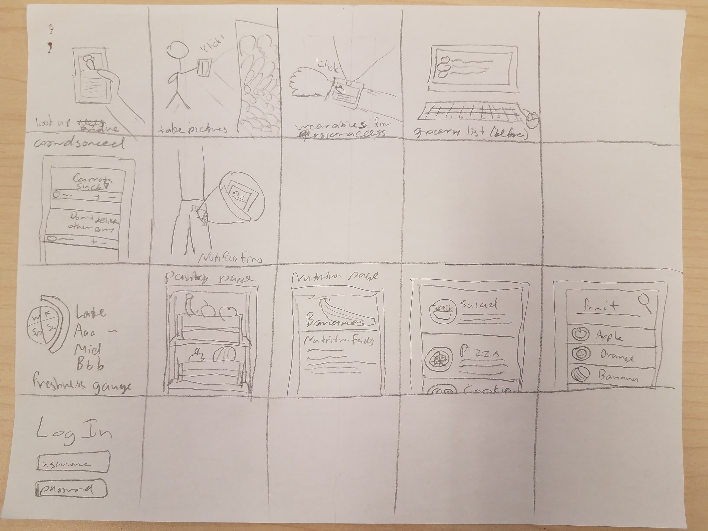

*Human-Computer Interaction, the study of how people interact with computers and to what extent computers are or are not developed for successful interaction with human beings.* - [Margaret Rouse](https://searchsoftwarequality.techtarget.com/definition/HCI-human-computer-interaction)

I think this definition eloquently defines the two sides of the scale for which the study hopes to balance as well as the two historically separate disciplines for which the study effectively combines. In the process of choosing to take a class focusing on design and the design process, everything I knew about design on a personal level was from emulating real-world designs I thought were interesting. Design to me felt more like of an abstract art than a quantifiable, measurable aspect of accomplishing a task, both of which I now see more clearly as parts of a larger whole. In my journey from start to finish, I participated in the design project, Sous Shopper, focusing as much on the process of designing it as to actually designing the product. From the project, I found that these 5 topics seemed to resonate when you explore them in their entirety. They are the following:
  1. Understand the problem at its root
  2. Define your ethical position responsibly
  3. Keep user accessibility in mind
  4. Churn out iterations
  5. Collect and review feedback

While I think there are generally more than these 5 categories, and this list certainly does not exhaust all aspects, I think what this list does provide is a generally encompassing group of important topics in design.  

### Understanding the Problem
Understanding any problem at its root is the most effective way of solving the problem. However, the scope of the problem is rarely and naively only what needs to be completed. If it involves people in any capacity, it then overwhelmingly involves considering who is needing the task to be completed as well as how and why they need to complete it. Understanding the problem at this scope allows you a frame for which your eventual solution can work through.

In Sous Shopper, the mode of understanding our problem was through initial private and group brainstorming sessions, conducting user research, then performing a task analysis. Brainstorming in this context is very important because unless their is a complete overhaul of your design, a version or at least key aspects of what is thought up in this step will end up in the final stages of your product. In Sous Shopper, fundamental decisions like the devices for which our solution will initially support usage as well as possible kinds of interfaces were generally defined and are still prevalent in the current product.

As for conducting user research, the group performed a combination of contextual inquiries and directed storytelling inquiries. While these are not the only forms of user research, specifically interviews and fly-on-the-wall observations were planned but could not be conducted due to logistical reasons, these two fit the best with our problem. Our goal was to amass pure information on the process by which shoppers select their produce so as to identify the key tasks done by a shopper and the underlying problem with any of the tasks by which or product could seamlessly fix. We conducted the inquiries on a variety of available people, taking some to grocery stores to watch them pick out produce as well as asking all of them questions and having them think aloud as they were shopping or reenacting a recent shopping experience. The main questions are as follows:

 - Do you have a grocery list, or do you decide on the spot?
   * If yes, what do you plan to buy?
 - How do you choose your produce?
   * Did you learn from anyone (i.e. a parent)?
   * Do you choose produce based on what’s in season?
   * Is it important to you that your produce is local?
 - Are you open to discovering new kinds of produce?

As for the task analysis, we used questions on what goes into the tasks being performed. Some of the more applicable are as follows:
  1. Who is going to use the design?
  2. What tasks do they now perform verses what tasks are desired?
  3. Where are the tasks performed?
  4. What other tools does the person have?
  5. How often are the tasks performed?
  6. What are the time constraints on the tasks?
  7. What happens when things go wrong?

Throughout this portion of design, the foundation of what the product is currently was established. The inquiries as well as the line of questioning brought forth very insightful and realistic views on the problems needing to be fixed, general aspects an average user would focus on, and the constraints of designing a product to be used while shopping. Perhaps the biggest realization was that we were not designing a product for ourselves but for people with possibly different needs than us. Thus getting as much outside information as possible is what will contribute the greatest towards finding a suitable solution.

### Ethics
Among the biggest subjects in what should influence design

At this phase in design, once you have dug deep into the problem at hand and have some grasp at what the general form of a solution should look like, the next step is to set up boundaries for yourself before going forward. This cannot be stressed enough, because a leap in the wrong direction this early in the design process will have much larger cascading effects by the time the flaw is eventually pointed out.

### Accessibility
As to why topics like iteration are so far back, I believe accessibility of a solution should be part of the original design and not an afterthought or add-on needing to be checked

### Iterate

### Feedback
